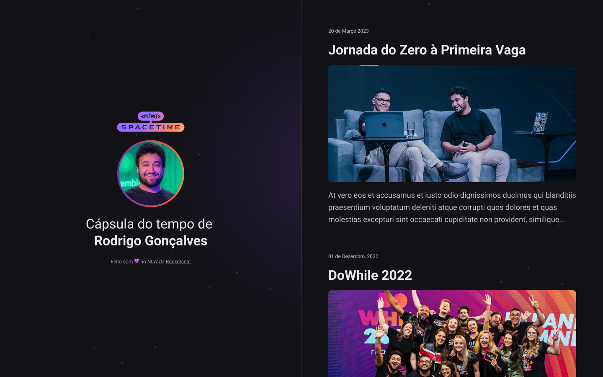

# NLW Spacetime Explorer - Rocketseat

## Cápsula do Tempo - em construção

Clique [AQUI](https://github.com/thiagofeldner/NLW_Spacetime_Explorer.git) para acessar o projeto completo.
 
Clique [AQUI](https://thiagofeldner.github.io/NLW_Spacetime_Explorer/) para acessar a página.

 

> ## 📝 Sobre o desafio
>
>  

Desenvolver uma aplicação Web responsiva de recordação de memórias utilizando HTML, CSS e deploy
com Github Pages.Nessa aplicação o usuário poderá adicionar memórias à uma timeline de acontecimentos
marcantes da sua vida.

 

> ## 🖥️ Tecnologias
>
>  

- HTML5
- CSS3
- Github Pages
- Google Fonts
